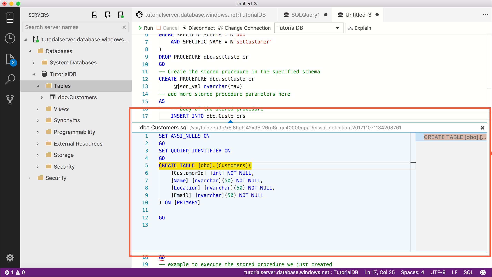
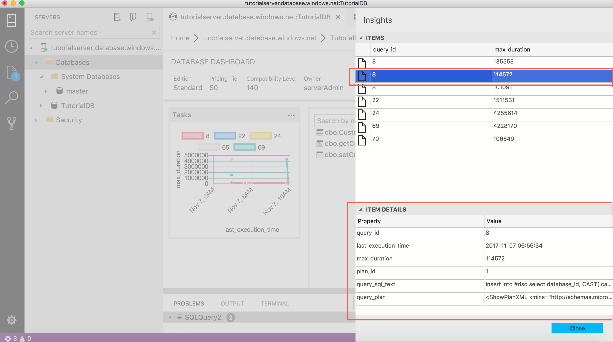
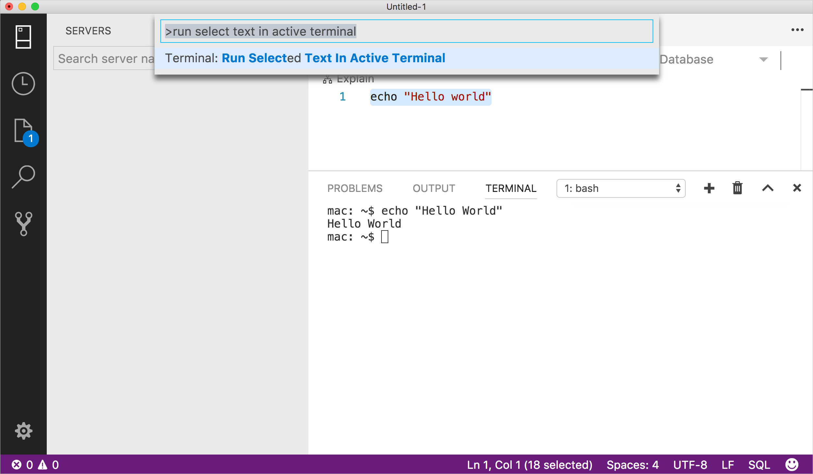

---
layout: post
title: SQL Server 2017 和 Azure Data Studio 介紹
date: 2021-01-12 12:00:00 +0800
categories: Software
--- 

本篇介紹 SQL Server 2017 推出時的新功能，以及 Azure Data Studio 的簡介。

### SQL Server 2017
- 現在支援安裝在 Linux，或使用 Docker 安裝，也可以和 R 語言、 Python 等多種語言。
- 在 Linux 上安裝時，可以使用主流發行套件的套件管理系統，例如：
a. Ubuntu : apt-get
b. Red Hat : rpm
- 使用 Docker 容器時，停止及移除容器會永久刪除容器中的所有 SQL Server 資料。如果要保留資料，應建立[備份檔案並複製至容器之外](https://docs.microsoft.com/zh-tw/sql/linux/tutorial-restore-backup-in-sql-server-container?view=sql-server-linux-2017)，或使用[容器資料持續性技術](https://docs.microsoft.com/zh-tw/sql/linux/sql-server-linux-configure-docker?view=sql-server-linux-2017#persist)。
- 參考資料 : [快速入門： 執行 SQL Server 2017 容器映像使用 Docker](https://docs.microsoft.com/zh-tw/sql/linux/quickstart-install-connect-docker?view=sql-server-linux-2017)
- 參考資料 : [動手玩Windows 10 Docker(6) - 用Docker來玩MSSQL資料庫, 在Linux上也有MSSQL?!](https://dotblogs.com.tw/swater111/2017/01/16/183653)

### Azure Data Studio 介紹 (舊稱 SQL Operations Studio)

Azure Data Studio 是微軟所推出的一套工具。具備連線到資料庫並對其進行管理和查詢的功能，其主要包含的特色如下：

1. 具備 IntelliSense 功能的 T-SQL 編輯器

> 支援關鍵字的自動完成功能、尋找某個資料庫物件的定義為何。
> 

2. 可以設定伺服器管理圖表的功能

> 撰寫 JSON 文件，描述圖表工具的形式和顯示的項目，即可在資料庫儀表板上看到資料庫的相關狀態。
> 下圖展示的圖表，是找出最慢的查詢項目。
> 
3. 整合終端機

> 不用再不斷的切換終端機和 SQL 管理工具視窗， SQL Operations Studio 內含整合型的終端機，可以直接操作系統指令。
> 

4. 提供暗色佈景主題，對時常撰寫 SQL 語法的開發者來說，眼睛更為舒適。

(圖片取自 [What is Microsoft SQL Operations Studio](https://docs.microsoft.com/zh-tw/sql/sql-operations-studio/what-is?view=sql-server-2017) )

- 參考資料：[詳盡的非官方網誌介紹](https://dotblogs.com.tw/christian_lee/2017/11/24/sqloperationstudio)