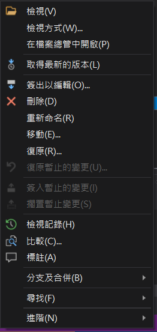

在微軟的 TFS 版本控制系統內，想要查詢是誰編輯了哪一行，除了逐一查詢檔案的變更紀錄以外，也可以查詢特定行的變更。

### 使用方式

TFS 的標註功能，可以查看特定行最後是由誰變更的（不過沒有該行的完整歷史）。

從原始碼檔案總管找到要檢查的檔案，點擊右鍵，並選擇標註 (Annotation)，就可以看到哪一段最後由誰編輯簽入。

### 參考資料

[TFS - getting history for specific line of code in Visual Studio - Stack Overflow](https://stackoverflow.com/questions/15928072/tfs-getting-history-for-specific-line-of-code-in-visual-studio)